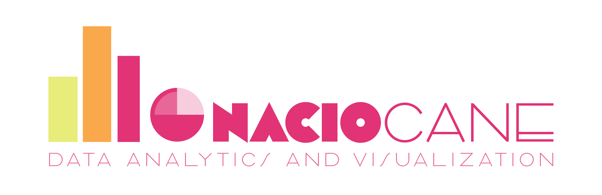

👋 **My name is Ignacio. I am a Psychology major from Buenos Aires, Argentina. I have extensive experience in Change Management for IT projects, where I developed both strong communication and analytical skills.**

🔍 **Nowadays, I work with clients who need to analyze raw data, find useful insights, and communicate them effectively to other people. My services include:**
- Data exploration, transformation and modelling.
- Development of reports and dashboards, both executive-friendly and in-depth.
- Design of PowerPoint presentations in business and other fields.
- Development of user-friendly flyers, infographics and videos for general audiences.

👇 **Some quick facts about me!**
- I studied Psychology at the University of Buenos Aires, obtaining my degree in 2021.
- I am currently living in Spain, studying a Master's degree at the University of Barcelona.
- I worked for more than 4 years as a senior change management consultant for IT projects, developing communication campaings, learning courses, and generating operational and executive reports on these activities.
- I am a _Microsoft Certified: Power BI Data Analyst Associate_, with strong Power BI and Excel skills. I also have a reasonable level of SQL and Python for data analytics.

**Please check the projects on this page to see some of my work! If you're interested in hiring my services, don't hesitate to contact me!**

